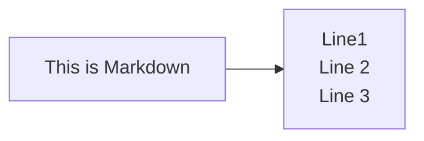

# SlideMD

## Markdown <!-- .hover:bg-red-500 .bg-blue-200 -->

This is a simple Markdown file that can be used to test the SlideMD application. You can write your content here, and it will be rendered as slides.

| Syntax      | Description |
| - | - |
| Header      | Title       |
| Paragraph   | Text        |

- [ ] to do
- [x] done
