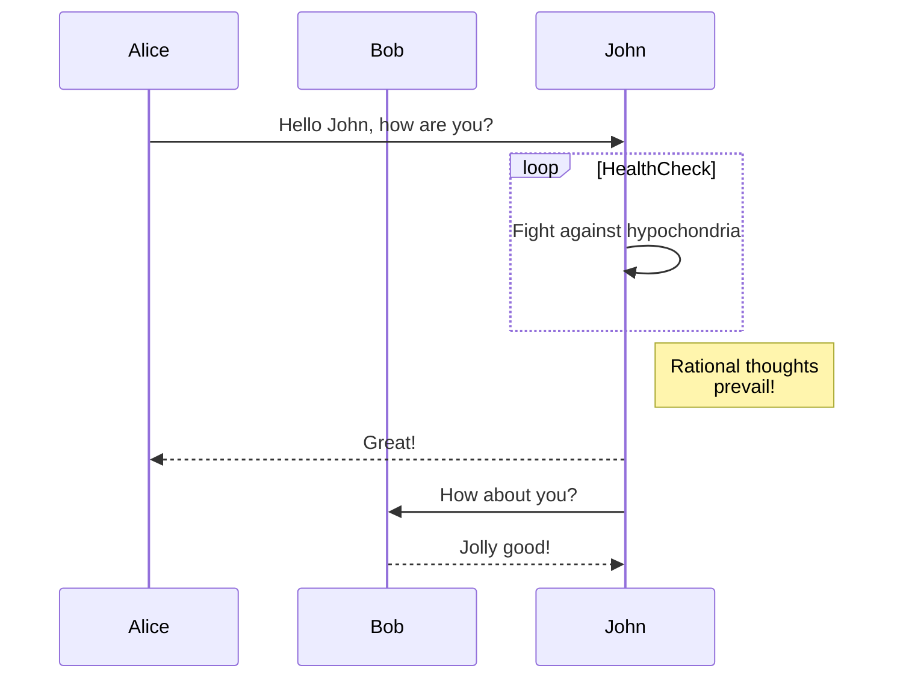

<!-- backgroundImage: url(https://fakeimg.pl/800x600/02669d/fff/?text=A) -->

# Hello, Marp

Make Presentation by Markdown with Marp

---

# Header 1

## Header 2

### Header 3

#### Header 4

##### Header 5

###### Header 6

---

## Paragraphs

I really like using Markdown.I think I'll use it to format all of my documents from now on.
I just love **bold text**.

Italicized text is the _cat's meow_.
This text is **_really important_**.

ฉันชอบมาร์กดาวจริง ๆ ฉันคิดว่าฉันจะใช้มันในการจัดการเอกสารทั้งหมดของฉัน

---

## Blockquotes

> Design decisions are made on a case-by-case basis through developer **consensus**

This is to ensure developers end up with a performant web server they intend to create. By extension, Elysia includes pre-built common pattern plugins for convenient developer usage:

---

## List

1. First item
2. Second item
3. Third item
4. Fourth item
    - Test 1
    - Test 2
    - Test 3

- First item
- Second item
- Third item

* First item
* Second item
* Third item
* Fourth item

---

## Code Block

Inline `Code`

```typescript
import { Elysia } from 'elysia'

new Elysia()
	.use(swagger()) // [!code ++]
	.get('/', 'Hello Elysia') // [!code --]
	.get('/user/:id', ({ params: { id } }) => id) // [!code hl:2]
	.post('/form', ({ body }) => body)
	.listen(3000)
```

---

## Link

My favorite search engine is [Duck Duck Go](https://duckduckgo.com).
<https://www.markdownguide.org>
<fake@example.com>

---

## Image

 <!-- .bg-red-500 -->

---

## Background


---

## Table

| Framework     | Runtime | Average     | Plain Text | Dynamic Parameters | JSON Body  |
| ------------- | ------- | ----------- | ---------- | ------------------ | ---------- |
| bun           | bun     | 262,660.433 | 326,375.76 | 237,083.18         | 224,522.36 |
| elysia        | bun     | 255,574.717 | 313,073.64 | 241,891.57         | 211,758.94 |
| hyper-express | node    | 234,395.837 | 311,775.43 | 249,675            | 141,737.08 |
| hono          | bun     | 203,937.883 | 239,229.82 | 201,663.43         | 170,920.4  |
| h3            | node    | 96,515.027  | 114,971.87 | 87,935.94          | 86,637.27  |
| oak           | deno    | 46,569.853  | 55,174.24  | 48,260.36          | 36,274.96  |
| fastify       | bun     | 65,897.043  | 92,856.71  | 81,604.66          | 23,229.76  |
| fastify       | node    | 60,322.413  | 71,150.57  | 62,060.26          | 47,756.41  |
| koa           | node    | 39,594.14   | 46,219.64  | 40,961.72          | 31,601.06  |
| express       | bun     | 29,715.537  | 39,455.46  | 34,700.85          | 14,990.3   |
| express       | node    | 15,913.153  | 17,736.92  | 17,128.7           | 12,873.84  |

---

## Strikethrough

~~The world is flat.~~ We now know that the world is round.

## Task list

- [x] Write the press release
- [ ] Update the website
- [ ] Contact the media

---

<iframe src="https://elysiajs.com" width="500" height="500"></iframe>

---

## Alert

### Classic

> Normal
> Test Normal Alert

### Note

> [!Note]
> Note alert

### Important

> [!Important]
> Important alert

### Tip

> [!Tip]
> Tip alert

---

### Warning

> [!Warning]
> Waning alert

### Caution

> [!Caution]
> caution alert

### Info

> [!Info]
> Info alert

### Example

> [!Example]
> Example alert

---

### Bug

> [!Bug]
> Bug alert

---


